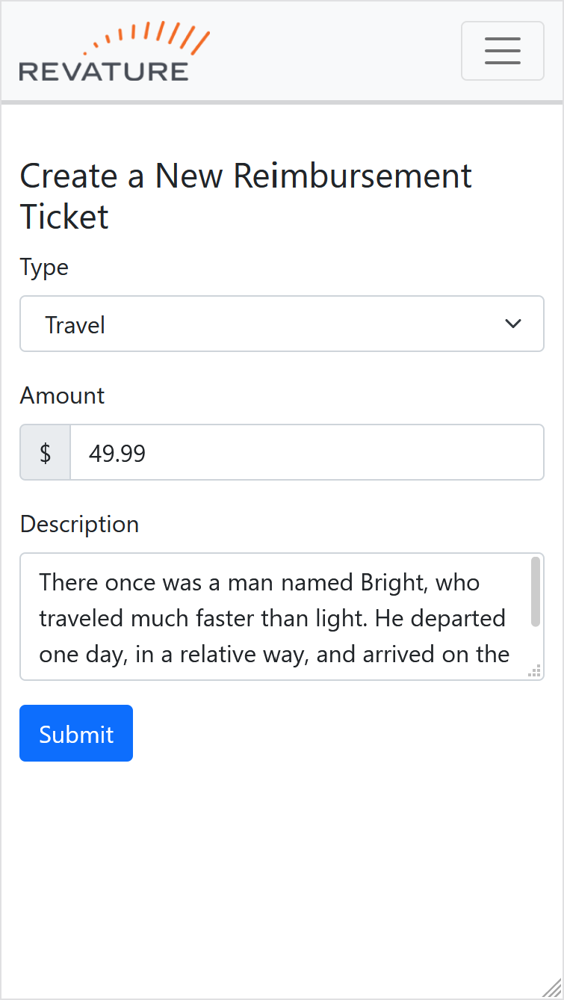
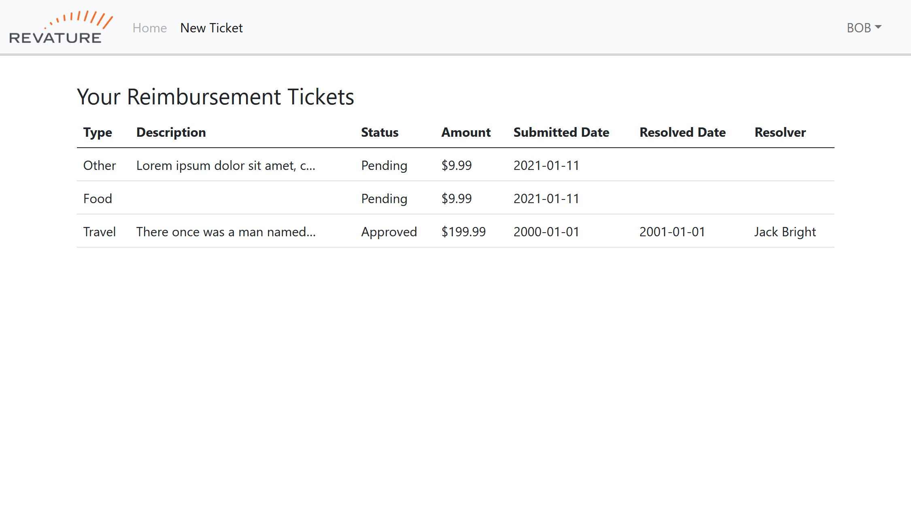

# Expense Reimbursement System

## Description

The Expense Reimbursement System (ERS) will manage the process of reimbursing employees for expenses incurred while on company time. All employees in the company can login and submit requests for reimbursement and view their past tickets and pending requests. Finance managers can log in and view all reimbursement requests and past history for all employees in the company. Finance managers are authorized to approve and deny requests for expense reimbursement.

## IDEs Used

* DBeaver
* Spring Tools Suite
* Visual Studio Code

## Technologies Used

* PostgreSQL
* Java, Maven, JDBC & JUnit
* HTML, CSS & JavaScript
* Bootstrap 5

## Features

* Facilitate reimbursements for all employees
    * Track author, description, submission/resolution dates and more for each ticket
    * Amounts stored using non-floating-point datatypes for perfect precision
* Manage reimbursement tickets
    * Approve or deny by company policy
    * View all past tickets and filter by status
* Client-side and server-side input validation
* Elegant and responsive styling for easy viewing on desktop and mobile platforms

## Getting Started

* Clone project with `git clone https://github.com/nsmith513/ExpenseReimbursementSystem.git`
* Use schema.sql to set up your postgres database
* Create a JSON file with the following properties:
```json
{
    "url": "YOUR DB URL HERE",
    "username": "YOUR USERNAME HERE",
    "password": "YOUR PASSWORD HERE"
}
```
* Update src/main/resources/log4j.properties with the location of your JSON file
* Compile project with Maven and deploy to Tomcat

## Usage

Employees can login, create new reimbursement tickets and view their ticket history.

<p align="center">
   
   
   <br/>
   
</p>

## License

Created by Nicholas Smith, licenced under Apache 2.0: https://www.apache.org/licenses/LICENSE-2.0.html
